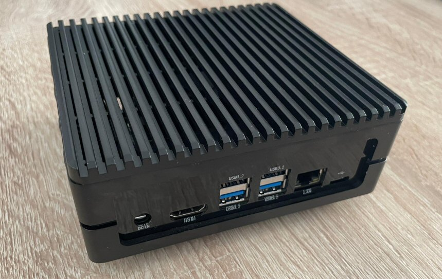
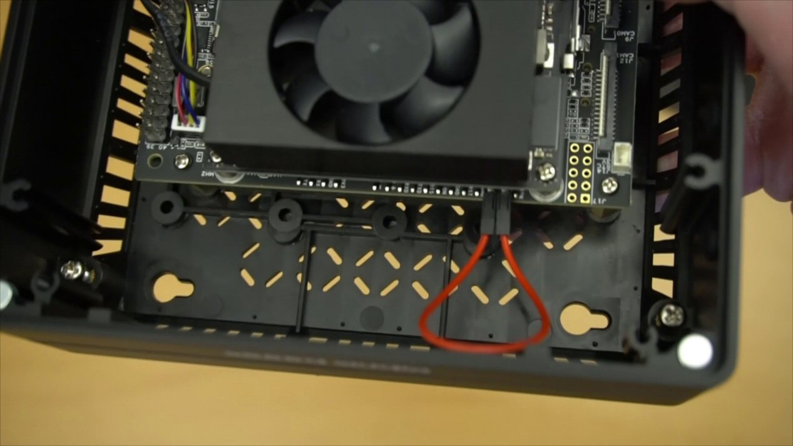

# Instructions for the Seeed reComputer J3010



These are the flashing instructions for the [Seeed J3010](https://www.seeedstudio.com/reComputer-J3010-p-5589.html) Edge AI Computer with NVIDIA® Jetson™ Orin™ Nano 4GB. [See here](https://github.com/balena-os/jetson-flash/tree/alanb-documentation?tab=readme-ov-file#instructions) for the list of other supported Jetson devices. 

## L4T/balenaOS/jetson-flash compatibility

The BSP version used by this flashing tool must match the BSP used in the version of balenaOS you're flashing. See the table below to determine which version of jetson-flash you should use:

| BSP version | Jetpack version | balenaOS version | Use this version of jetson-flash |
|-------------|-----------------|------------------|----------------------------------|
| 36.3        | 6.0             | 6.0 or later     | you are on the current version.     |
| 35.5        | 5.x             | lower than 6.0   | [v0.5.72](https://github.com/balena-os/jetson-flash/commit/fc1904907391f4bb1a8599a477910bcaea932e5e) |


## Requirements
- Docker needs to be installed on the Host PC and the Docker image needs to be run as privileged
- The balenaOS image downloaded from balena-cloud needs to be unpacked and copied on your Host PC inside the `~/images/` folder. This location will be bind mounted inside the running container.
- The Docker image and the associated scripts require a Linux-based host and have been validated on a PC running Ubuntu 22.04. Other host operating systems or virtualized environments may also work, provided that the Nvidia BSP flashing tools are able to communicate with the Jetson device successfully over USB
- We don't formally test Ubuntu 22.04 in VMWare virtual machines, but it seem to work. More specifically, with VMWare Fusion for Mac and VMWare Workstation for Windows. Note: when prompted by VMWare choose to automatically connect the NVIDIA Corp. APX USB device (i.e. the Orin device) to the VM rather than to the host.
- Flashing of the Seeed reComputer J3010 with a NVME attached can be done solely by using the Docker image inside this folder (Orin_Flash). The Dockerfile and the scripts inside this folder are not used by jetson-flash and should be used as a stand-alone means for flashing BalenaOS on Orin devices.

### Seeed reComputer J3010 Flashing steps:

1. Ensure a NVME drive is attached to the Seeed reComputer J3010
2. Download your balenaOS image from balena-cloud, unpack and write it to a USB stick. We recommend using <a href="https://www.balena.io/etcher">Etcher</a>.
3. Place the balenaOS unpacked image inside the folder ~/images on your HOST PC. This location will be automatically bind-mounted in the container image in the `/data/images/` folder
4. Put the Seeed reComputer J3010 in Force Recovery mode:
   1. Ensure the device is powered off and the power adapter disconnected.
   2. Open the top lid of the reComputer and place a jumper across the Force Recovery Mode pins. These are pins ("GND") and ("FC REC") and are located on the carrier board, under the Orin Nano module. 
   3. Connect your host computer to the device's USB-C connector.
   4. Connect the power adapter to the Power Jack [J2].
   5. The device will automatically power on in Force Recovery Mode.
   6. Confirm your device is running in recovery mode by issuing the command `lsusb | grep NVIDIA` and you should see output similar to: `Bus 003 Device 005: ID 0955:7023 NVIDIA Corp. APX` (The APX is important)
5. Insert the USB stick created above in any of the USB ports of the Seeed reComputer J3010 Flashing
6. Navigate to the `Orin_Flash` folder and run the Docker image by executing the `build_and_run.sh` script:
```
~/jetson-flash$ cd Orin_Flash/
~/jetson-flash/Orin_Flash$ ./build_and_run.sh
```
7. Once the docker image has been built and starts running, the balenaOS kernel and flasher image can be booted by executing the `flash_orin_nx.sh` script:
```
root@03ce5cbcbb0d:/usr/src/app/orin-flash# ./flash_orin.sh -f /data/images/<balena.img> -m jetson-orin-nano-seeed-j3010
```

Other considerations:
- The flashing process takes around 5-10 minutes and once it completes, the board will power-off. The device can be taken out of recovery mode and the USB flasher stick can be unplugged.
- Remove and reconnect power to the device.

## Support

If you're having any problems, please [raise an issue](https://github.com/balena-os/jetson-flash/issues/new) on GitHub and the balena.io team will be happy to help.


License
-------

The project is licensed under the Apache 2.0 license.
