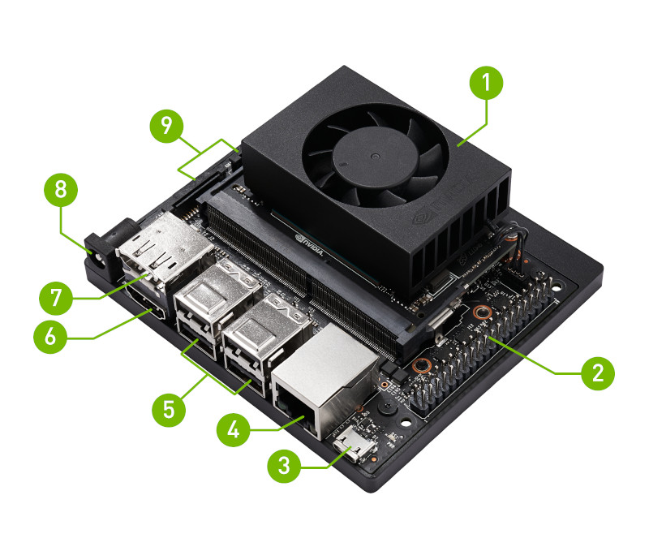

# Instructions for the Jetson Orin NX in Xavier NX Devkit NVME



These are the flashing instructions for the Jetson Orin NX in Xavier NX Devkit NVME. For the list of other balena-supported Jetson devices [See here](https://github.com/balena-os/jetson-flash?tab=readme-ov-file#instructions). 

## L4T/balenaOS/jetson-flash compatibility

**Use the version of jetson-flash that corresponds to the version of balenaOS that you would like to provision per the table below.**

(Each version of jetson-flash uses a specific version of NVIDIA's L4T BSP to properly partition the Jetson's boot media. This BSP version must also match the BSP used in the version of balenaOS you're flashing)

| balenaOS version | BSP version | Jetpack version | Use this version of jetson-flash |
|------------------|-------------|-----------------|----------------------------------|
| 5.3.22 or later     | 36.3        | 6.0             | You are on the correct version. (v0.5.73 or greater)      |
| 5.3.12 - 5.3.21    | 35.5.0        | 5.1.3            | [v0.5.72](https://github.com/balena-os/jetson-flash/tree/v0.5.72) |
| 4.1.5 - 5.3.10   | 35.4.1      | 5.1.2           | [v0.5.67](https://github.com/balena-os/jetson-flash/tree/v0.5.67) |
| 2.115.18 - 4.1.2 | 35.3.1      | 5.1.1           | [v0.5.57](https://github.com/balena-os/jetson-flash/tree/v0.5.57) |
| 2.114.0  - 2.115.13   | 35.2.1      | 5.1    |   [0.5.49](https://github.com/balena-os/jetson-flash/tree/v0.5.49)   |


## Requirements
- Docker needs to be installed on the x86 Host PC and the Docker image needs to be run as privileged
- The balenaOS image downloaded from balena-cloud needs to be unpacked and copied on your Host PC inside the `~/images/` folder. This location will be bind mounted inside the running container.
- The Docker image and the associated scripts require a Linux-based host and have been validated on a PC running Ubuntu 22.04. Other host operating systems or virtualized environments may also work, provided that the Nvidia BSP flashing tools are able to communicate with the Jetson device successfully over USB
- We don't formally test Ubuntu 22.04 in VMWare virtual machines, but it seem to work. More specifically, with VMWare Fusion for Mac and VMWare Workstation for Windows. Note: when prompted by VMWare choose to automatically connect the NVIDIA Corp. APX USB device (i.e. the Orin device) to the VM rather than to the host.

### Jetson Orin NX in Xavier NX Devkit NVME Flashing steps:


1. Attach a NVMe drive to the Xavier NX Devkit
2. Download your balenaOS image from balena-cloud, unpack and write it to a USB stick. We recommend using <a href="https://www.balena.io/etcher">Etcher</a>.
3. Place the balenaOS unpacked image inside the folder ~/images on your HOST PC. This location will be automatically bind-mounted in the container image in the `/data/images/` folder
4. Put the Jetson Orin NX in Force Recovery mode:
   1. Ensure the device is powered off and the power adapter disconnected.
   2. Place a jumper across the Force Recovery Mode pins. These are pins 9 ("GND") and 10 ("FC REC") of the Button Header (J14). 
   3. Connect your host computer to the device's USB Micro-B connector.
   4. Connect the power adapter to the Power Jack [J16].
   5. The device will automatically power on in Force Recovery Mode.
   6. Confirm your device is running in recovery mode by issuing the command `lsusb | grep NVIDIA` and you should see output similar to: `Bus 003 Device 005: ID 0955:7023 NVIDIA Corp. APX` (The APX is important)
5. Insert the USB stick created above in any of the 4 USB ports of the Xavier NX Devkit
6. Clone this repo to your host PC.
7. Navigate to the `Orin_Flash` folder and run the Docker image by executing the `build_and_run.sh` script:
```
~/jetson-flash$ cd Orin_Flash/
~/jetson-flash/Orin_Flash$ ./build_and_run.sh
```
7. Once the docker image has been built and starts running, the balenaOS kernel and flasher image can be booted by executing the `flash_orin_nx.sh` script:
```
root@03ce5cbcbb0d:/usr/src/app/orin-flash# ./flash_orin.sh -f /data/images/<balena.img> -m jetson-orin-nx-xavier-nx-devkit

```

Other considerations:
- The flashing process takes around 5-10 minutes and once it completes, the board will power-off. The device can be taken out of recovery mode and the USB flasher stick can be unplugged.
- Remove and reconnect power to the device.

## Support

If you're having any problems, please [raise an issue](https://github.com/balena-os/jetson-flash/issues/new) on GitHub or ask a question [in our forums](https://forums.balena.io/c/share-questions-or-issues-about-balena-jetson-flash-which-is-a-tool-that-allows-users-to-flash-balenaos-on-nvidia-jetson-devices/95) and the balena.io team will be happy to help.


License
-------

The project is licensed under the Apache 2.0 license.
