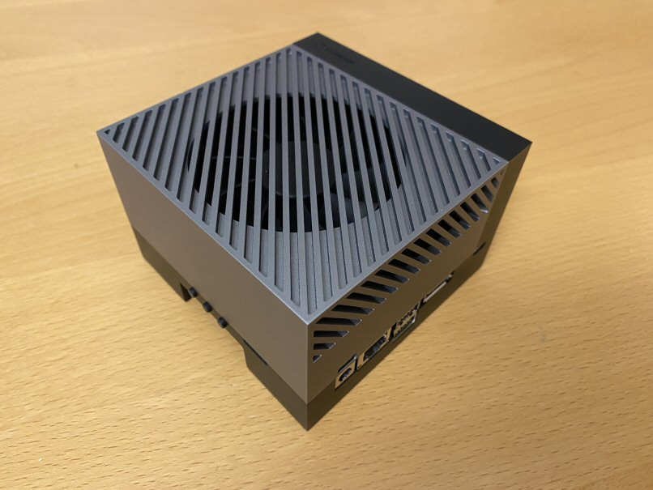

# Instructions for the Jetson AGX Orin Devkit 64GB



These are the flashing instructions for the [Jetson AGX Orin Developer Kit 64GB](https://www.nvidia.com/en-us/autonomous-machines/embedded-systems/jetson-orin/). For the list of other balena-supported Jetson devices [See here](../README.md#instructions).

## L4T/balenaOS/jetson-flash compatibility

**Use the version of jetson-flash that corresponds to the version of balenaOS that you would like to provision per the table below.**

(Each version of jetson-flash uses a specific version of NVIDIA's L4T BSP to properly partition the Jetson's boot media. This BSP version must also match the BSP used in the version of balenaOS you're flashing)

| balenaOS version | BSP version | Jetpack version | Use this version of jetson-flash |
|------------------|-------------|-----------------|----------------------------------|
| 6.4.0 or later   | 36.4.3      | 6.2             | You are on the correct version. (v0.5.86 or greater)              |
| 6.0.6 - 6.3.6    | 36.3        | 6.0             | [v0.5.85](https://github.com/balena-os/jetson-flash/tree/v0.5.85) |


## Requirements
- Docker needs to be installed on the x86 Host PC and the Docker image needs to be run as privileged
- The balenaOS image downloaded from balena-cloud needs to be unpacked and copied on your Host PC inside the `~/images/` folder. This location will be bind mounted inside the running container.
- The Docker image and the associated scripts require a Linux-based host and have been validated on a PC running Ubuntu 22.04. Other host operating systems or virtualized environments may also work, provided that the Nvidia BSP flashing tools are able to communicate with the Jetson device successfully over USB
- We don't formally test Ubuntu 22.04 in VMWare virtual machines, but it seem to work. More specifically, with VMWare Fusion for Mac and VMWare Workstation for Windows. Note: when prompted by VMWare choose to automatically connect the NVIDIA Corp. APX USB device (i.e. the Orin device) to the VM rather than to the host.

## Jetson AGX Orin Devkit 64GB Flashing steps:

NOTE: By default, balenaOS is flashed on the Jetson AGX Orin 64GB Devkit's eMMC; You can change the default using the instructions below.

1. Download your balenaOS image from balena-cloud, unpack and write it to a USB stick. We recommend using [Etcher](https://www.balena.io/etcher).
2. If you would like to flash and boot from a NVME drive instead of the eMMC, please follow these steps: 
   1. After writing your balenaOS image to the USB key, mount the flash-rootA partition of the USB stick and open the file `etc/resin-init-flasher.conf` located in it.
   2. The first line of this file is `INTERNAL_DEVICE_KERNEL="mmcblk0"`. Replace `mmcblk0` with `nvme0n1`, save and close the file.
   3. Ensure the flash-rootA partition is unmounted before removing the USB key from your PC.
   4. IMPORTANT: Flashing balenaOS on the NVME will erase the contents of the device's eMMC as well. Please make sure to back-up your data.
3. Place the balenaOS unpacked image inside the folder ~/images on your HOST PC. This location will be automatically bind-mounted in the container image in the `/data/images/` folder
4. Put the AGX Orin Devkit 64GB in Force Recovery mode:
   1. Make sure you connect the Type-C plug of the data cable to the USB Type-C port used for flashing, which is located next to 40-pin connector.
   2. While holding the middle Force Recovery button, insert the USB Type-C power supply plug into the USB Type-C port above the DC jack. 
   3. This will turn on the Jetson dev kit in Force Recovery Mode.
   4. Release the middle Force Recovery button
   5. Confirm your device is running in recovery mode by issuing the command `lsusb | grep NVIDIA` and you should see output similar to: `Bus 003 Device 005: ID 0955:7023 NVIDIA Corp. APX` (The APX is important)
5. Insert the USB stick created above in the upper USB port located near the the display port of the AGX Orin Devkit 64GB.
6. Clone this repo on your host PC.
7. Navigate to the `Orin_Flash` folder and run the Docker image by executing the `build_and_run.sh` script:
```
~/jetson-flash$ cd Orin_Flash/
~/jetson-flash/Orin_Flash$ ./build_and_run.sh
```
8. Once the docker image has been built and starts running, the balenaOS kernel and flasher image can be booted by executing the `flash_orin_nx.sh` script:
```
root@03ce5cbcbb0d:/usr/src/app/orin-flash# ./flash_orin.sh -f /data/images/<balena.img> -m jetson-agx-orin-devkit-64gb
```

Other considerations:
- The flashing process takes around 5-10 minutes and once it completes, the board will power-off. The device can be taken out of recovery mode and the USB flasher stick can be unplugged.
- Remove and reconnect power to the device.
- The Orin NX 8GB and 16GB can be emulated during flashing of the Jetson AGX Orin Devkit - [more information here](https://github.com/balena-os/jetson-flash/blob/master/Orin_Flash/agx_orin_emulation.md).
## Support

If you're having any problems, please [raise an issue](https://github.com/balena-os/jetson-flash/issues/new) on GitHub or ask a question [in our forums](https://forums.balena.io/c/share-questions-or-issues-about-balena-jetson-flash-which-is-a-tool-that-allows-users-to-flash-balenaos-on-nvidia-jetson-devices/95) and the balena.io team will be happy to help.


License
-------

The project is licensed under the Apache 2.0 license.
