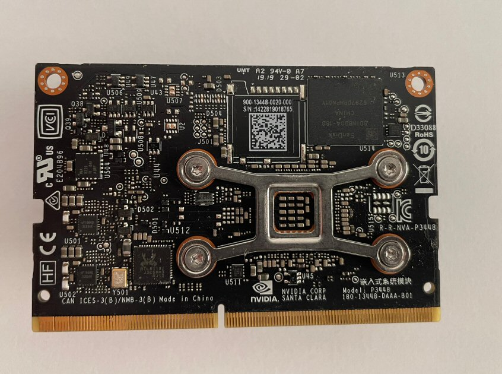

# Instructions for the Jetson Nano eMMC



These are the flashing instructions for the [Jetson Nano eMMC]([https://www.nvidia.com/en-us/autonomous-machines/embedded-systems/jetson-orin/](https://developer.nvidia.com/embedded/jetson-nano)). For the list of other balena-supported Jetson devices [See here](https://github.com/balena-os/jetson-flash/tree/alanb-documentation?tab=readme-ov-file#instructions). 

Note that this is for the production Jetson Nano module without an SD card slot, **not** the [Jetson Nano SD Card Developer Kit](jetson-nano.md), which has an SD card slot on the module itself.

## L4T/balenaOS/jetson-flash compatibility

**Use the version of jetson-flash that corresponds to the version of balenaOS that you would like to provision per the table below.**

(Each version of jetson-flash uses a specific version of NVIDIA's L4T BSP to properly partition the Jetson's boot media. This BSP version must also match the BSP used in the version of balenaOS you're flashing)

| balenaOS version | BSP version | Jetpack version | Use this version of jetson-flash |
|------------------|-------------|-----------------|----------------------------------|
| 2.108.9+rev1 or later     | 32.7.3      | 4.6.3  | You are on the correct version. (v0.5.38 or later)    |
|2.101.1 - 2.108.9 | 32.7.2      | 4.6.2           |    [v0.5.37](https://github.com/balena-os/jetson-flash/tree/v0.5.37)    |
| 2.95.15+rev1 -  2.101.0      | 32.7.1  | 4.6.1   |   [v0.5.28](https://github.com/balena-os/jetson-flash/tree/v0.5.28)                 |
| 2.87.1+rev1 - 2.95.14 | 32.6.1 | 4.6             |   [v0.5.21](https://github.com/balena-os/jetson-flash/tree/v0.5.21)               |
|2.82.11+rev2 - 2.85.2+rev5  | 32.5.1 | 4.5.1      |   [v0.5.13](https://github.com/balena-os/jetson-flash/tree/v0.5.13)       |
| 2.67.2+rev1 - 2.82.11+rev1   | 32.4.4    | 4.4.1 | [v0.5.10](https://github.com/balena-os/jetson-flash/tree/v0.5.10) |


## Requirements
Jetson Flash requires an x86 Linux-based host (or virtual machine) and has been tested on Ubuntu 22.04 (Focal).

You can either install all the prerequisites listed below or run the provided Docker image (using Docker, not balenaOS) on the host.

### non-Docker

Prerequisites:

- Sudo privileges (required by Tegra Flash and to delete intermediate steps created by the tool in `/tmp/${pid_of_process}`)
- [NodeJS](https://nodejs.org)
- Make sure you have python2 installed and that the `python` binary points to python2.
- Dependencies required for the the L4T package, including: lbzip2, e2fsprogs, dosfstools, libxml2-utils, lz4

Installation:

Make sure the prerequesites listed above are installed.

Clone this repository:
```sh
$ git clone https://github.com/balena-os/jetson-flash.git
```

Install Node.js dependencies by issuing the following command in the jetson-flash directory:
```sh
$ npm install
```

### Docker

Prerequisites:

- the Docker image should be run as privileged
- `/dev/bus/usb` needs to be bind-mounted for the Tegra BSP tools to communicate with the device

Installation:

Clone this repository:
```sh
$ git clone https://github.com/balena-os/jetson-flash.git
```

## How to use

Follow the steps below to flash your Jetson board

### Recovery mode

Make sure that the Jetson board is plugged into your host via USB and is in recovery mode before issuing the flashing command. 

We only test jetson-flash on the reference NVIDIA carrier board. If your carrier board varies significantly from the NVIDIA Jetson Nano Developer Kit you may need to contact the manufacturer for the proper recovery mode steps.

With power off, enable Force Recovery mode by placing a jumper across the "FRC" pins of the Button Header on the carrier board.

- For carrier board revision A02, these are pins 3 ("FC REC") and 4 ("GND") of Button Header J40 which is located near the camera header.
- For carrier board revision B01, (and the Nano 2GB) these are pins 9 ("GND") and 10 ("FC REC") of Button Header J12, which is located on the edge of the carrier board under the Jetson module.

Then power on the device.

**Confirmation**

You can confirm your device is running in recovery mode by issuing the command `lsusb | grep NVIDIA` and examining the output.

You should see something similar to the below, depending on your board:

```
Bus 003 Device 005: ID 0955:7023 NVIDIA Corp. APX

```

(The `APX` is crucial to confirming recovery mode.) 

Or

```
Bus 001 Device 019: ID 0955:7c18 NVIDIA Corp. T186 [TX2 Tegra Parker] recovery mode
```

### Run the tool

For **non - Docker**, run the tool by specifying the path to the unzipped image (in place of "<balena.img>") and the device type as shown below:

```sh
$ ./bin/cmd.js -f <balena.img> -m jetson-nano-emmc
```

For **Docker**, issue the following commands in the folder that has the Dockerfile to build the container (building may take a while and appear to hang, so be patient.) Create a folder named `images` in your home directory and place your balena image file there so it's available inside the container.

```sh
./build.sh [-m jetson-nano-emmc]
```

You can then enter the container using:

```sh
docker container run --rm -it --privileged -v /dev/bus/usb:/dev/bus/usb -v ~/images:/data/images jetson-flash-image /bin/bash
```

Alternatively, run the provided docker-compose file with `docker-compose up` and ssh into the container with `docker exec -it <container name> /bin/bash` 

Once in the container, you can run jetson-flash by specifying the balena image in your host's `~/images/` folder (in place of "<balena.img>"):

```sh
./bin/cmd.js -f /data/images/<balena.img> -m jetson-nano-emmc --accept-license=yes -c /tmp/Linux_for_Tegra
```

You can alternatively just run the jetson-flash tool in a single command by running the container with this command:

```sh
docker container run --rm -it --privileged -v /dev/bus/usb:/dev/bus/usb -v ~/images:/data/images jetson-flash-image ./bin/cmd.js -f /data/images/<balena.img> -m jetson-nano-emmc --accept-license=yes -c /tmp/Linux_for_Tegra
```

It will exit upon completion. 

---

The flashing process may take 5 - 15 minutes or longer during which a lot of log output will appear. If all goes well, you'll see something similar to the following upon completion:

```
*** The target t186ref has been flashed successfully. ***
Reset the board to boot from internal eMMC.

```
## Support

If you're having any problems, please [raise an issue](https://github.com/balena-os/jetson-flash/issues/new) on GitHub or ask a question [in our forums](https://forums.balena.io/c/share-questions-or-issues-about-balena-jetson-flash-which-is-a-tool-that-allows-users-to-flash-balenaos-on-nvidia-jetson-devices/95) and the balena.io team will be happy to help.


License
-------

The project is licensed under the Apache 2.0 license.
